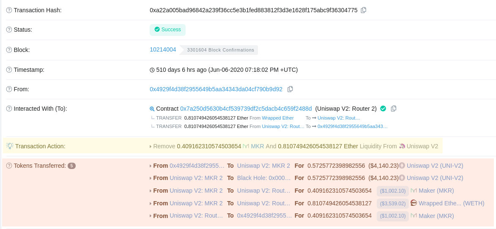
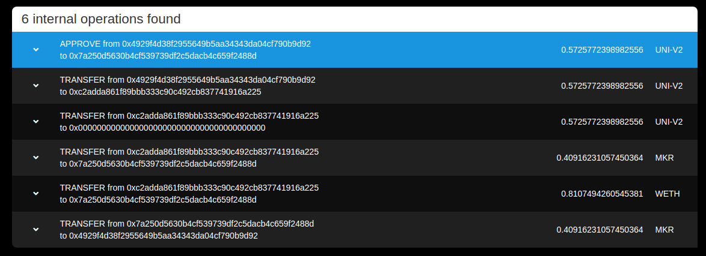
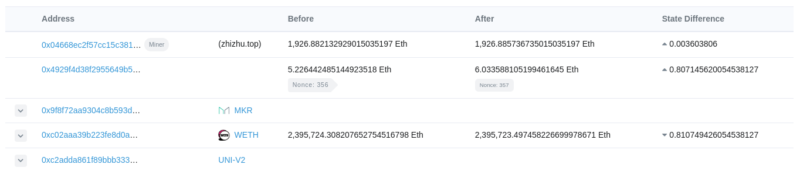
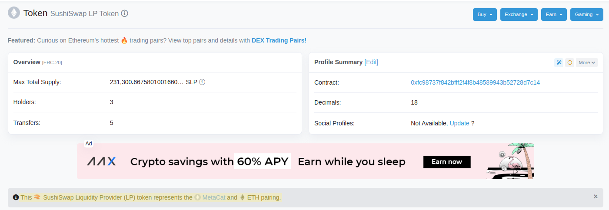

# Problem

Given a transaction that interacts with a liquidity pool, how can we deduce the
specific account action (swap vs. LP add/remove and token pair) that was taken
using only the transaction data?


--------------------------------------------------------------------------------


# Research

We are currently researching transactions that interact with the following
protocols:

- Uniswap
- Compound
- SushiSwap
- Olympus

## Example data

A random account which has interacted with various services was picked randomly
from a recent block, at address:

[```0x4929f4d38f2955649b5aa34343da04cf790b9d92```](https://etherscan.io/address/0x4929f4d38f2955649b5aa34343da04cf790b9d92)

The following transactions it sent will be referenced:

| Action | Tx Hash |
|--------|---------|
| **Uniswap V2**: Remove **0.41 MKR** and **0.81 ETH** Liquidity | [`0xa22a00...304775`](https://etherscan.io/tx/0xa22a005bad96842a239f36cc5e3b1fed883812f3d3e1628f175abc9f36304775) |
| **Uniswap V2**: Supply **2474.15 WILD** and **0.985 ETH** Liquidity | [`0x64f98a...e67548`](https://etherscan.io/tx/0x64f98a82cb5c8fae4f3a5299f7fa7440e20e67cc5f187b40b5c3476f85e67548) |
| **Uniswap V3**: Swap **0.75 ETH** for **2050.50 WILD** and **0.25 ETH** for **696.65 WILD** | [`0x817f4a...a51a89`](https://etherscan.io/tx/0x817f4a22893c88cdbd148b064b27bc40db82e8e532f4abfcb2e793936ca51a89) |
| **SushiSwap**: Swap **1.63 COMP** for **0.12 ETH** | [`0x41f977...0ac0b5`](https://etherscan.io/tx/0x41f977dadaaaca951c048274181d2afc9edf665a1b9fdb2c0d47a5c0c60ac0b5)


--------------------------------------------------------------------------------


# Reading account actions from transactions

We know that account actions can be inferred from raw transactions not only on
principle but also because Etherscan does it, as seen below under
**Complications** regarding transaction
[`0xa22a00...304775`](https://etherscan.io/tx/0xa22a005bad96842a239f36cc5e3b1fed883812f3d3e1628f175abc9f36304775),
correctly identifying the account action (removing liquidity) and the tokens in
question (ETH and MKR). This transaction involves the user interacting with the
**Uniswap v2 Router** contract at
[`0x7a250d...f2488d`](https://etherscan.io/address/0x7a250d5630b4cf539739df2c5dacb4c659f2488d).

## Complications

For our problem, we have only an address, and it is necessary to decode the
transaction input data and/or logs in order to reason about the underlying trade
represented by a given transaction (which coins were swapped, whether wETH was
burnt, etc).  It is not easy to do this, though Etherscan is able to do it as
shown in the **Transaction Action** field.

*Below, in yellow: Etherscan's computed "Transaction Action" field parsing the
account action from a transaction (not available via API); in red: ERC20
transfers involved in the transaction.*



This is not exposed by the API, and has [been requested many
times](https://ethereum.stackexchange.com/questions/97076/how-to-get-transaction-action-etherscan),
enough that Etherscan has commented on it:

> We unfortunately do not have an endpoint that returns the "Transaction Action"
> information at this point of time. It is a popular one by request, and we will
> definitely consider to add it in a future update.
> 
> *—Etherscan Support*

Thus, it seems to be nontrivial to decode the account action from a raw
transaction, and this will involve reproducing logic similar to that of
Etherscan's **Transaction Action** field.

In addition, because each liquidity pair (at least on Uniswap) has its own
dedicated contract, it is also not feasible to simply look at an address's
interactions with a single contract to gather liquidity provision trades.  It
would be necessary to load a list of *all* Uniswap LP contracts for *each* token
pair and then cross-reference an account's ERC20 token transfers with each
contract address using the following Etherscan API call:

```ts
`https://api.etherscan.io/api
   ?module=account
   &action=tokentx
   &address=${address}
   &contractAddress=${pairLPContractAddress}`
```

And this does not appear to be a sustainable approach.

## Recommendations

Despite these complications, in general, it *is* possible to find *all* of a
user's account actions on a protocol, without distinguishing the specific action
or learning much about it, by loading all of an address's transactions (after a
given block height, for a fixed lookback period) and searching the user's
transactions for interactions with the protocol's routing contract.

Once logic to decode account actions from raw transactions is established, it
will be possible to parse these transactions to understand whether they are
swaps or adding/removing liquidity, and the underlying token pair, etc.

For now, it is recommended to simply **count the number of trades on a
protocol** and use this as an initial stat until a way to decode transactions is
known.

## Prototypical example

To count the number of SushiSwap transactions our test trader,
`0x4929f4...0b9d92`, has made, we simply count their interactions with the
SushiSwap routing contract, `0xd9e1cE...378B9F`.


--------------------------------------------------------------------------------


### Reading the user's transactions

An address's transactions can be read for free, up to 5 requests per second,
from the following endpoint:

```ts
`https://api.etherscan.io/api
  ?module=account
  &action=txlist
  &address=0x4929f4d38f2955649b5aa34343da04cf790b9d92`
```

### Looking for SushiSwap trades

It is trivial to count the number of trades (liquidity provision and swaps) the
user has made like so:

```js
const address = `0x4929f4d38f2955649b5aa34343da04cf790b9d92`;
const transactionsRequest = await fetch(
  `https://api.etherscan.io/api?module=account&action=txlist&address=${address}`
);

const transactions = await transactionsRequest.json();
const trades = transactions.result.filter(
  (tx) => tx.to == '0xd9e1ce17f2641f24ae83637ab66a2cca9c378b9f'
);

console.log(`User ${address} made ${trades.length} SushiSwap trades!`);
// User 0x4929f4d38f2955649b5aa34343da04cf790b9d92 made 64 SushiSwap trades!
```

## Iterating in the future

Ultimately it will not be ideal to depend only on lightweight free APIs, and the
service will likely call for setting up a complete Ethereum node and querying
it for data directly rather than relying on Etherscan and other services.

It will also be necessary to learn more about how to reliably decode raw
transactions and read underlying trade data from them, and some writing of
particular interest to this research is [this blog
post](https://messari.io/article/retrieving-uniswap-trades-using-the-graph) by
Diran Li.  It is certainly possible and is just a matter of time investment.


--------------------------------------------------------------------------------


# Exhibits

Various block explorers are capable of simulating internal transactions and/or
decoding input data.

## Internal transactions 

*Below: Ethplorer displaying the internal transactions for tx
[`0xa22a00...304775`](https://etherscan.io/tx/0xa22a005bad96842a239f36cc5e3b1fed883812f3d3e1628f175abc9f36304775).*



## State changes

*Below: The state changes for the same transaction as above.*



## Identifying an ERC20 LP token

*Below (highlighted): Etherscan identifying the pair a given SushiSwap LP token
represents, here the **MCAT/ETH SushiSwap LP** token
[`0xfc9873...8d7c14`](https://etherscan.io/token/0xfc98737f842bfff2f4f8b48589943b52728d7c14).*

